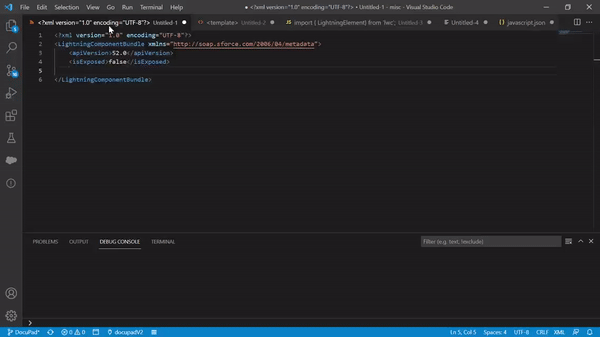

# Salesforce Code Snippets

It includes code snippets for Apex and LWC (HTML, Javascript, graphQuery, CSS, and XML).

## Features

**Demo**

**Glossary**

**LWC (HTML)**
<ul>
    <li> tpi: template  lwc:if </li>
    <li> tpf: template  lwc:elseif </li>
    <li> tpe: template  lwc:else </li>
    <li> tpf: template if:false </li>
    <li> fore: template for:each </li>
    <li> itr: template Iterator:it </li>
    <li> lgin: lightning-input </li>
    <li> lgic: lighting-icon </li>
    <li> lgbb: lightning-button with brand variant </li>
    <li> lgbo: lightning-button with brand-outline variant </li>
    <li> spin: Lightning spinner with template if true</li>
    <li> sldstable: HTML table with slds selector including one th and td tag.</li>
    <li> lgcard: Lightning card with custom title</li>
    <li> paginator: Generate code for pagination.</li>
    <li> grid: SLDS grid.</li>
    <li> gridcenter: SLDS grid with center align.</li>
    <li> gridspace: SLDS grid with space align.</li>
    <li> gridspread: SLDS grid with spread align.</li>
    <li> gridend: SLDS grid with end align.</li>
    <li> bumpleft: SLDS bump left.</li>
    <li> bumpright: SLDS bump right.</li>
    <li> aligncenter: SLDS align absolute center.</li>
    <li> sldsmodal: SLDS Modal.</li>
    </ul>

**LWC (Javascript)**

<ul>
    <li> con: class constructor</li>
    <li> clg: console.log() </li>
    <li> cle: console.error() </li>
    <li> clc: console.clear() </li>
    <li> func: method() </li>
    <li> edc: export default class() </li>
    <li> wrmt: wire method </li>
    <li> cmt: method comments </li>
    <li> clt: class comments </li>
    <li> toast: showToast method</li>
    <li> dce: dispatch custom event</li>
    <li> imap: import apex </li>
    <li> imcl: import custom label </li>
    <li> imsr: import static resource </li>
    <li> imob: import sObject </li>
    <li> imcr: import create record</li>
    <li> imur: import update record</li>
    <li> imdr: import delete record</li>
    <li> imst: import showToastEvent</li>
    <li> imld: import loadStyle and loadScript </li>
    <li> impv: import getPicklistValues</li>
    <li> imgq: import gql, graphql, refreshGraphQL</li>
    <li> imra: import refreshApex </li>
    <li> imna: import Navigation </li>
    <li> imf: import file </li>
    <li> qsl: query selector using data id</li>
    <li> nvur: navigate to url method</li>
    <li> paginator: Generate code for pagination.</li>
    <li> arrow: Creates named arrow method.</li>
    <li> etv: event.target.value</li>
    <li> etc: event.target.checked</li>
    <li> etd: event.target.dataset.id</li>
    <li> jst: JSON.stringify()</li>
    <li> jsp: JSON.parse()</li>
    <li> jspt: JSON.parse(JSON.stringify())</li>
    <li> getrec: LDS get record.</li>
    <li> create: LDS create record.</li>
    <li> update: LDS update record.</li>
    <li> delete: LDS delete record.</li>
    <li> tcf: try catch and finally block.</li>
    <li> pick: getPicklistValues wire handler.</li>
    <li> gqy: Sample graph query.</li>
</ul>

**LWC (CSS)**

<ul>
<li> btnbrand: Changes the lightning button color.</li>
<li> icnutl: Changes the lightning icon color.</li>
<li> fds: field set  selectors</li>
<li> brc: brand color</li>
</ul>

**LWC (XML)**

<ul>
<li> tgts: targets</li>
<li> dgts: design attributes to use in the app builder</li>
</ul>

**Apex**
<ul>
 <li> pvm: public void method </li>
 <li> psm: public string method </li>
 <li> pim: public integer method </li>
 <li> plm: public object[] method </li>
 <li> psem: public set<object> method </li>
 <li> pmm: public Map<string, object> method </li>
 <li> arm: Aura Enabled method </li>
 <li> armc: Aura enabled method with cacheable true </li>
 <li> arp: Aura enabled property</li>
 <li> syd: System.debug()</li>
 <li> cmt: method level comment </li>
 <li> clt: class level comments </li>
 <li> batch: Apex batch class skeleton</li>
 <li> singleEmail: single email message</li>
 <li> saveResult: Save result with database.dml type along with success and failed result</li>
 <li> req: Http request callout</li>
 <li> soql: SOQL statement</li>
</ul>

**Visualforce**
<ul>
    <li> lgtout: lightning out code to call aura or lwc on vf</li>
</ul>

**Developer**
> Gurjit Singh https://www.linkedin.com/in/gurjitssingh/   

**Enjoy!**
